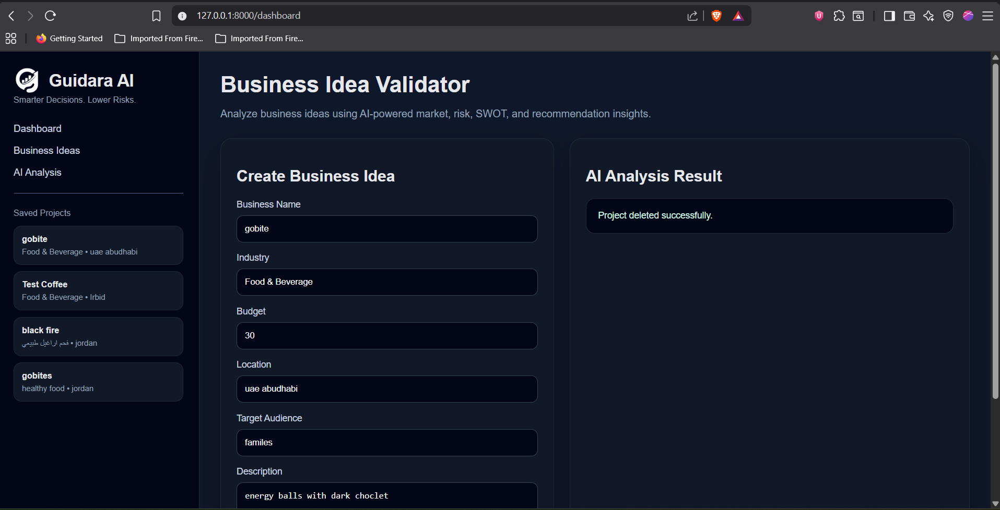
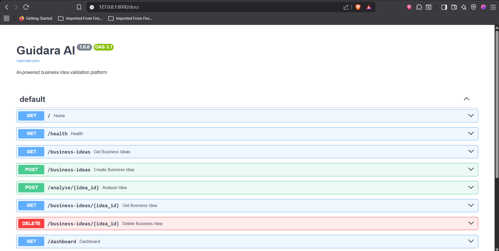
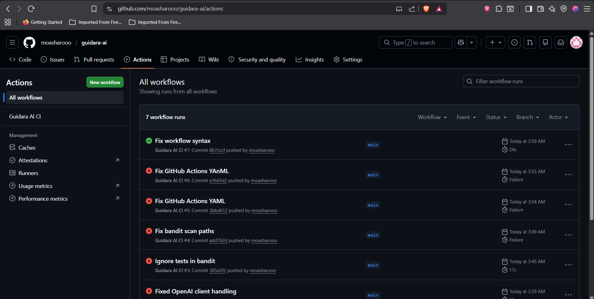

# 🚀 Guidara AI


# 🚀 Guidara AI

### AI-Powered Business Idea Validation Platform

Guidara AI is an intelligent business validation platform that helps entrepreneurs, startups, and innovators evaluate business ideas before investing time and money.

The platform leverages Artificial Intelligence to analyze market opportunities, competition levels, risks, financial feasibility, SWOT factors, and strategic recommendations to support better business decisions.

---

# 📌 Project Overview

Many entrepreneurs fail because they launch businesses without validating market demand, understanding competitors, or estimating risks.

Guidara AI solves this problem by providing AI-generated business analysis and actionable insights based on user-provided business information.

The platform transforms a simple business concept into a comprehensive validation report within seconds.

---

# 🎯 Main Objectives

* Validate business ideas using AI.
* Analyze market opportunities.
* Estimate business risks.
* Identify strengths and weaknesses.
* Provide strategic recommendations.
* Support startup decision-making.
* Reduce business failure rates.

---

# ✨ Features

## Business Idea Management

* Create business ideas
* Store ideas permanently
* Retrieve previous projects
* Delete projects
* Project history sidebar

## AI Business Analysis

The platform automatically generates:

### Market Analysis

* Market demand evaluation
* Industry overview
* Customer behavior insights

### Risk Assessment

* Risk Score
* Risk Factors
* Business Challenges

### Success Prediction

* Success Probability
* Growth Potential
* Market Readiness

### SWOT Analysis

#### Strengths

* Competitive advantages
* Internal capabilities

#### Weaknesses

* Internal limitations
* Resource gaps

#### Opportunities

* Market opportunities
* Emerging trends

#### Threats

* Competitors
* Market risks

### Strategic Recommendations

* Growth strategies
* Marketing recommendations
* Financial advice
* Business development plans

---

# 🏗 System Architecture

Frontend Dashboard
↓
FastAPI Backend
↓
Business Logic Layer
↓
OpenAI API
↓
SQLite Database

---

# 🛠 Technology Stack

## Backend

* Python 3.13
* FastAPI
* SQLAlchemy
* Pydantic

## Database

* SQLite

## AI Integration

* OpenAI API

## Testing

* Pytest

## Security

* Bandit

## DevOps

* Git
* GitHub
* GitHub Actions
* Docker

---

# 📂 Project Structure

```text
guidara-ai/
│
├── app/
│   ├── main.py
│   ├── dashboard.py
│
├── database/
│   └── database.py
│
├── models/
│   └── business.py
│
├── services/
│   └── ai_service.py
│
├── tests/
│   └── test_api.py
│
├── .github/
│   └── workflows/
│       └── ci.yml
│
├── requirements.txt
├── Dockerfile
├── README.md
└── guidara.db
```

# 🧪 Testing

Automated testing is implemented using Pytest.

Covered Tests:

* Health Endpoint Test
* Home Endpoint Test
* Create Business Idea Test

Run tests:

```bash
pytest -v
```

# 🔒 Security Scanning

Bandit is integrated to perform static security analysis.

Run security scan:

```bash
bandit -r app database models services
```

# ⚙ Continuous Integration

GitHub Actions automatically performs:

* Dependency installation
* Automated testing
* Security scanning

Pipeline Status:

✅ Automated Testing

✅ Security Analysis

✅ CI/CD Workflow

# 🐳 Docker Support

Build image:

```bash
docker build -t guidara-ai .
```

Run container:

```bash
docker run -p 8000:8000 guidara-ai
```

Access application:

```text
http://localhost:8000
```

# 🔑 Environment Variables

Create a .env file:

```env
OPENAI_API_KEY=your_openai_api_key
```

# 🚀 Running the Project

Install dependencies:

```bash
pip install -r requirements.txt
```

Run application:

```bash
uvicorn app.main:app --reload
```

Open:

```text
http://127.0.0.1:8000/dashboard
```

Swagger Documentation:

```text
http://127.0.0.1:8000/docs
```

Future Improvements

* User Authentication
* PDF Report Export
* Financial Forecast Charts
* Competitor Comparison Engine
* Multi-language Support
* Cloud Deployment
* Advanced Analytics Dashboard

Developed By

Mohammad Alsharo

Computer Science Student 157852

Jordan University of Science and Technology (JUST)

---

 License

This project was developed for academic and educational purposes as a Graduation Project.

---

Guidara AI

**Smarter Decisions. Lower Risks.**


# Screenshots

## Dashboard




## API Documentation



## CI/CD Pipeline


